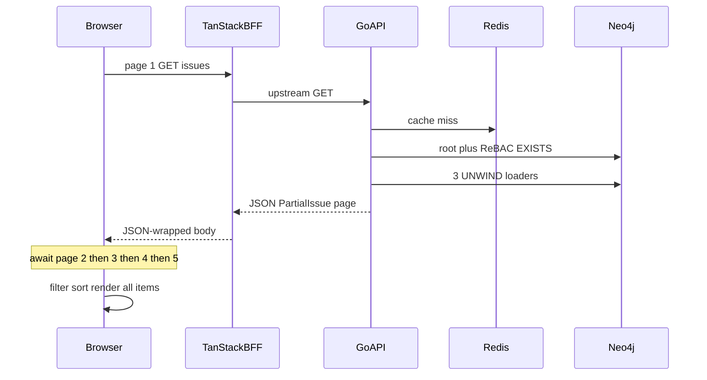

# Work-item list latency


| author       | created at | status        |
| ------------ | ---------- | ------------- |
| architecture | 2026-08-20 | observational |


## Abstract

Loading ~100 work items on the Work surface takes about **2–4 seconds** locally
(sub-10ms service latency). Loading ~500 takes about **5–10 seconds**. That is
too slow for production, where Neo4j, Redis, and the API will add tens of
milliseconds of RTT on every hop.

This report traces the load path, ranks root causes, and estimates the effect
of mitigations at the UI, API/Cypher, cache, and observability layers. Timings
in the headline are **local observations**. Breakdowns and improvement ranges
are **engineering estimates** calibrated to those observations, not
`PROFILE` / pprof / benchstat results. Confirm the Neo4j share with the
checklist at the end before committing to Cypher changes.

Work items in the product UI are **Issues**. There is no separate work-item
type in the backend.

## Scope


| Surface                                            | Data source                      | Typical size                                    |
| -------------------------------------------------- | -------------------------------- | ----------------------------------------------- |
| Project Work (`/namespaces/:ns/projects/:id/work`) | `GET /v1/projects/{id}/issues`   | ~100–125 issues per live project in the prefill |
| Namespace Work (`/namespaces/:ns/work`)            | `GET /v1/namespaces/{id}/issues` | hundreds across projects                        |
| My Work / Home                                     | `GET /v1/users/{id}/issues`      | assigned subset                                 |


Issue search (`GET /v1/search`) is a separate Meilisearch path and is **not**
how boards and tables load. See [ADR 0022](../ADRs/0022.permission-aware-search.md).

## Observed timings


| Items shown | HTTP pages (page_size=100) | Observed TTI (local, cache miss) |
| ----------- | -------------------------- | -------------------------------- |
| ~100        | 1                          | ~2–4s                            |
| ~500        | 5 sequential               | ~5–10s                           |


500 items is not 5× 100 items. Later cursor pages hit a warm Neo4j page cache
(~0.8–1.5s each, estimated), so total time grows with page count but not
linearly.

## Post-change verification (2026-08-21)

The latency fixes in this work item were verified on a freshly prefilled local
stack with:

- project `da44q8n92rs308qgcvr0` (`ACR`, 124 issues)
- namespace `da44q8f92rs308qgcs00` (`Operations`, 500 issues)
- user `da44q6n92rs308qgcbvg` (`demo@meridian.example`)

### k6 authenticated benchmark

Command:

```bash
docker exec elemo-redis redis-cli FLUSHALL
docker run --rm \
  -e AUTH_CLIENT_ID=... \
  -e AUTH_CLIENT_SECRET=... \
  -e BASE_URL="http://host.docker.internal:35478" \
  -e K6_CONFIG="/tests/config/work-item-latency.json" \
  -e K6_NAMESPACE_ID="da44q8f92rs308qgcs00" \
  -e K6_PROJECT_ID="da44q8n92rs308qgcvr0" \
  -e K6_USER_ID="da44q6n92rs308qgcbvg" \
  -v "$PWD/tests:/tests" \
  grafana/k6 run --out json=/tests/work-item-latency-targeted.json /tests/main.js
```

Observed (cold = first pass after Redis flush, warm = immediate second pass):

| Scope     | Items | Pages | Page 1 cold | Collect cold | Page 1 warm | Collect warm |
| --------- | ----- | ----- | ----------- | ------------ | ----------- | ------------ |
| Project   | 124   | 2     | 1104 ms     | 1959 ms      | 3.45 ms     | 9 ms         |
| Namespace | 500   | 5     | 1299 ms     | 4743 ms      | 2.93 ms     | 20 ms        |
| User      | 0     | 1     | 294 ms      | 294 ms       | 1.76 ms     | 2 ms         |

Payload totals from the same run remained unchanged for the current DTO shape:

- project list: ~89 KB (`89353` bytes)
- namespace list: ~395 KB (`394831` bytes)

### Jaeger span baselines

Representative traces from the same stack:

- `transport.http.handler/V1ProjectsIssuesGet` (cold miss): `1096 ms` total,
  `1092 ms` inside `repository.neo4j.IssueRepository/ListForProject`, Redis
  get/set under `3 ms` combined.
- `transport.http.handler/V1ProjectsIssuesGet` (warm hit): `1.08 ms` total,
  served from Redis get (`0.76 ms`) with no Neo4j list span.
- `transport.http.handler/V1NamespacesIssuesGet` (cold miss): `1296 ms` total,
  `1294 ms` inside `repository.neo4j.IssueRepository/ListForNamespace`.
- `transport.http.handler/V1NamespacesIssuesGet` (warm hit): `0.66–1.01 ms`
  total across sampled traces, served from Redis.

These traces confirm the remaining cold-path dominant cost is still in the
Neo4j list query, while warm-path latency is now effectively cache-read bound.

### Neo4j PROFILE baselines

`PROFILE` was run for the compiled `issue.list_for_project` and
`issue.list_for_namespace` shapes (with scope filter and page limit 101):

| Query                     | Time | DbHits | Rows | Memory |
| ------------------------- | ---- | ------ | ---- | ------ |
| `issue.list_for_project`  | 336 ms | 5766 | 101 | 37304 bytes |
| `issue.list_for_namespace` | 186 ms | 6744 | 101 | 38184 bytes |

The profile and Jaeger numbers are directionally consistent: cold-path time is
dominated by the root list query plus authorization traversal, while warm-path
requests avoid that cost.

## Load path

The Work surface does **not** issue one HTTP request per card. It collects
cursor pages, then filters and sorts in the browser.




1. Route layout may first load accessible namespaces, collect projects, fetch
  the project, then check `project.read`
   (`[web/src/lib/operational-route-data.ts](../../web/src/lib/operational-route-data.ts)`).
2. `[work-surface.tsx](../../web/src/components/work/work-surface.tsx)` uses
  `[collectedListQuery](../../web/src/lib/api/cursor-pages.ts)`: follow
   `next_page_token` up to `MAX_CURSOR_PAGES` (10) at `DEFAULT_LIST_PAGE_SIZE`
   (100). The React Query stays pending until **every** page returns.
3. Each browser call goes through a TanStack Start server function
  (`[protectedApiTransport](../../web/src/lib/api/transport.ts)`), which
   fetches the Go API and wraps the body as a JSON string.
4. `IssueController.V1*IssuesGet` maps to `issueService.List*` then
  `RedisCachedIssueRepository.ListFor*` then Neo4j
   (`[internal/transport/http/issue.go](../../internal/transport/http/issue.go)`).
5. Neo4j runs a root list query with a per-candidate ReBAC `EXISTS`, then up
  to three `UNWIND $ids` loaders (parent, assignments, labels) in one read
   transaction ([ADR 0020](../ADRs/0020.query-projections-and-relationship-fetching.md),
   `[executePartialIssueList](../../internal/repository/issue.go)`).
6. The client adapts `PartialIssue` rows, runs `queryWorkItems` (filter/sort),
  and renders. List and timeline mount every row. The board windows 25 cards
   per column but still holds the full array in memory.

Relation batching on a single page is working as designed. The cost is
**serial pages + per-row authz + payload/render**, not HTTP N+1 per card.

## Ranked root causes


### 1. Collect-all and sequential cursors (highest UX impact)

`[collectCursorPages](../../web/src/lib/api/cursor-pages.ts)` awaits page N
before starting N+1. Saved-view filters and sorts run only after the full set
is in memory (`[queryWorkItems](../../web/src/lib/mock-data/selectors.ts)`).
Issue-list queries use `cacheProfiles.volatile` (**15s** `staleTime`) in
`[web/src/lib/api/query-options.ts](../../web/src/lib/api/query-options.ts)`,
so remounts refetch.

This is why ~100 items (one page) land in 2–4s and ~500 items (five pages)
land in 5–10s: the UI will not paint until the last cursor returns.

### 2. Per-issue ReBAC `EXISTS` in the list Cypher (highest server cost)

`[IssueListQuery.Compile](../../internal/repository/issue_query.go)` injects
`[AuthzVisibleExistsClause](../../internal/repository/permission.go)` on every
candidate issue:

- `IN_SCOPE_OF*0..` with **no hop cap**. The product hierarchy is only Issue →
Project → Namespace → Organization ([ADR 0021](../ADRs/0021.scoped-rebac-authorization.md)).
- Quadratic acyclicity:
`ALL(node IN nodes(path) WHERE size([other IN nodes(path) WHERE other = node]) = 1)`.
- Nested role `EXISTS` per `GRANTED` edge.

The predicate sits in `WHERE` **before** `ORDER BY` / `LIMIT`. A 100-issue
project evaluates roughly 100 path walks; a 500-issue namespace list evaluates
roughly 500. Search already inverts this with `ListGrantScopes`
([ADR 0022](../ADRs/0022.permission-aware-search.md)). Lists do not.

### 3. Extra hop and double JSON (production amplifier)

Browser → TanStack Start server function → Go API. `serializeResponse` reads
the entire upstream body as text and returns it inside the server-fn JSON.
Locally each extra hop is cheap (~20–80ms/page, estimated). At 50–80ms RTT,
five serial pages × two hops add **~0.5–1.5s** of wait **on top of** slower
Neo4j.

### 4. Over-fetch for cards

`PartialIssue` always includes `description`, a nested `parent` (another full
partial), project, namespace, and reporter
(`[partialIssueToDTO](../../internal/transport/http/project.go)`). Non-compact
board cards parse that summary with marked, DOMPurify, and highlight.js
(`[markdown-html.ts](../../web/src/lib/work/markdown-html.ts)`). Prefill
descriptions are short; real tenants will be worse.

### 5. Layout waterfall before the list

`[loadProjectOperationalContext](../../web/src/lib/operational-route-data.ts)`
runs accessible namespaces → collect all projects → `GET /v1/projects/{id}` →
permission check, all serial, on the critical path (~200–800ms before the first
issues request, estimated).

### 6. Redis cache-aside is a miss-path bandage

`[RedisCachedIssueRepository.ListFor*](../../internal/repository/issue.go)`
helps repeat views. First load, and any write that calls
`clearIssueAllForNamespace` / `clearIssueAllCrossCache`, still pays Neo4j.
`Set` has no TTL. The in-process local cache is off. Neo4j `QuerySummary`
(`ResultAvailableAfter` / `ResultConsumedAfter`) is computed in
`[query_exec.go](../../internal/repository/query_exec.go)` and discarded.

### Not the root cause

- HTTP N+1 per card (lists batch with `UNWIND $ids`).
- GraphQL resolver N+1 (REST only).
- Missing uniqueness on `Issue.id` (constraint exists in
`[assets/queries/bootstrap.cypher](../../assets/queries/bootstrap.cypher)`).
- Dual TEXT + UNIQUE indexes on every `id` are a planner smell, not the 2–4s.


## Estimated latency budget (local, cache miss)


| Share of perceived TTI        | What                                      | Notes                                            |
| ----------------------------- | ----------------------------------------- | ------------------------------------------------ |
| ~55–70% of each page          | Neo4j root + ReBAC `EXISTS`               | Dominant for the 2–4s single-page case           |
| ~40–60% of the jump 100 → 500 | Sequential extra pages                    | Warm later pages ~0.8–1.5s each                  |
| ~10–15% per page              | Three loaders + JSON encode + Redis `SET` | After the root query                             |
| small locally / large in prod | BFF wrap                                  | ~20–80ms/page local; RTT-bound in prod           |
| ~5–20% after data arrives     | React markdown / DOM                      | Board windows 25/column; list and timeline worse |
| ~200–800ms before issues GET  | Layout waterfall                          | Namespaces → projects → project → permission     |


Production with 50–80ms RTT adds **~0.5–1.5s** from five × two serial hops,
plus whatever extra Neo4j time a remote store costs. That is why the local
numbers are already a production problem.

## Mitigations by layer

Gains are versus the current **500-item 5–10s TTI** unless noted. Stacked
gains are **not additive**.

### L1 — UI / BFF (largest TTI win, days of work)


| Mitigation                                                                                                                                        | Estimated effect                                                                          | Prod RTT sensitivity                              |
| ------------------------------------------------------------------------------------------------------------------------------------------------- | ----------------------------------------------------------------------------------------- | ------------------------------------------------- |
| Render page 1 immediately; fetch pages 2–N in the background                                                                                      | TTI → **~2–4s** (same as 100 items) with no backend change. With L2, target **<1s** local | High: removes serial pages from the critical path |
| Stop collect-all for boards (`page_size=50`, server status/priority/text). If grouping needs the full set, keep collecting but do not block paint | First paint tracks one small page                                                         | High                                              |
| Omit `description` on list DTOs; cards use title + plain `line-clamp` (no marked/hljs)                                                            | Payload **−30–60%**; board render **−100–800ms**                                          | Medium (bytes on the wire)                        |
| Virtualize list and timeline (`@tanstack/react-virtual`)                                                                                          | Needed at 500+ DOM nodes; board already windows 25/column                                 | Low                                               |
| Issue-list `staleTime` 15s → entity (5 min)                                                                                                       | Remounts stop refetching                                                                  | Low locally; avoids repeat miss cost              |
| Collapse BFF: HTTP proxy or stream GET without JSON-wrapping the body                                                                             | Local: small. Prod: **−400–1200ms** on 5-page collects                                    | High                                              |
| Parallelize layout loader (`Promise.all` where safe)                                                                                              | **−150–500ms** to first issues request                                                    | Medium                                            |


### L2 — API / Cypher (highest server win)


| Mitigation                                                                                                                                     | Estimated effect                                                           | Prod RTT sensitivity                                               |
| ---------------------------------------------------------------------------------------------------------------------------------------------- | -------------------------------------------------------------------------- | ------------------------------------------------------------------ |
| Invert authz: one `ListGrantScopes(issue.read)`, then `WHERE (i)-[:IN_SCOPE_OF*0..4]->(s) WHERE s.id IN $scope_ids` (same idea as search)      | **−50–90%** of Neo4j list time → **~200–600ms/page** local on this dataset | Medium (fewer DB CPU-ms; hop count unchanged unless loaders merge) |
| Cap `IN_SCOPE_OF` at 4 hops; drop the quadratic `ALL`/`size` check (cycles are rejected at write)                                              | **−20–40%** of remaining `EXISTS` cost even without invert                 | Low                                                                |
| Project-list shortcut (product check): if `project.read` implies every issue in that project, skip per-issue `EXISTS` after one `Has(project)` | **−70–95%** of list authz on the common board                              | Low                                                                |
| List projection: `RETURN i { .id, .title, ... }` not whole nodes; parent as `{id,key,title}` only                                              | Smaller records; helps encode and payload                                  | Medium                                                             |
| Server filter/sort (`status`, `priority`, `q`, `order`)                                                                                        | Client does not download 500 to hide 400                                   | High                                                               |


### L3 — Cache / read model


| Mitigation                                                                                        | Estimated effect                                                                                                 |
| ------------------------------------------------------------------------------------------------- | ---------------------------------------------------------------------------------------------------------------- |
| Finer invalidation (project list key only; stop `clearIssueAllForNamespace` on every issue write) | Repeat-view hit rate up; **first load unchanged**                                                                |
| Request-scoped grant-scope cache (one Neo4j round trip per HTTP request)                          | Helps L2 invert; small on its own                                                                                |
| Optional denormalized card index (Meilisearch or Redis JSON) for board fields only                | Last resort. Search is a sibling store, not a list backend ([ADR 0022](../ADRs/0022.permission-aware-search.md)) |


### L4 — Observability (unlocks real numbers)


| Mitigation                                                                            | Why                                             |
| ------------------------------------------------------------------------------------- | ----------------------------------------------- |
| Attach `QuerySummary` to OTel spans (`db.neo4j.result_available_after`)               | `QuerySummary` is already built and thrown away |
| Histogram `elemo_issue_list_seconds{scope,page_size}`                                 | Separate project vs namespace vs user lists     |
| `PROFILE` `issue.list_for_project` and `issue.list_for_namespace` on the prefilled DB | Required before large Cypher rewrites           |


## Stacked improvement summary

Estimates, cache **miss**, ~500 items unless noted:


| Stage                                                                      | Local TTI      | ~50ms RTT TTI   | Assumption                                     |
| -------------------------------------------------------------------------- | -------------- | --------------- | ---------------------------------------------- |
| Baseline (today)                                                           | 5–10s          | 6–12s           | Five serial pages on the critical path         |
| After L1 (progressive paint, drop list descriptions, layout `Promise.all`) | ~2–4s          | ~2.5–5s         | TTI ≈ one page; remaining pages background     |
| After L1 + L2 (invert/bound authz)                                         | **~300–800ms** | **~500–1200ms** | First page 50–100 items, not five serial pages |
| Repeat view, Redis hit, after L1                                           | **<200ms**     | ~200–400ms      | Payload still matters at high RTT              |


Do not add the column percentages in the budget to these stacked numbers. L1
removes waiting for pages 2–5 from TTI; L2 shrinks the remaining page.

## Recommended sequence

1. Confirm with `PROFILE` and Jaeger that `EXISTS` dominates (1–2 hours). See
  the checklist below.
2. L1: progressive first paint and omit list descriptions. TTI for 500 items
  should match today’s 100-item TTI.
3. L2: invert or bound authz so a page is hundreds of milliseconds, not
  seconds.
4. Server-side filter/sort if boards still pull full namespaces.
5. Collapse the BFF hop after L1/L2, or in parallel if production RTT is
  already painful.


## Measurement checklist

Run these on the prefilled local stack before treating any estimate as a
commitment.

1. **Browser Network** — Work surface load. Count `issues` requests, page
  size, start times (serial vs overlapping), and TTFB vs download vs
   content-download. Note whether the UI paints before the last page.
2. **Payload** — Size of one `PartialIssue` page with and without
  `description`. Compare gzip.
3. **Jaeger** — Spans
  `transport.http.handler/V1ProjectsIssuesGet` (or namespace/user),
   `service.issueService/List*`, `repository.neo4j.IssueRepository/ListFor*`.
   Today Neo4j subquery time is not exported; after L4 it should be.
4. **Neo4j** `PROFILE` — Prefix the compiled Cypher for
  `issue.list_for_project` and `issue.list_for_namespace` (copy from a trace
   or log). Check db hits on the `EXISTS` / `IN_SCOPE_OF*0..` expansion versus
   the `LIMIT`. Repeat with hop cap `*0..4` as a side-by-side.
5. **Redis** — First load vs immediate reload of the same board. If reload is
  still seconds, the miss path or the BFF/UI collect-all is still on the
   critical path.
6. **React profiler** — Board vs list vs timeline for 500 items. Markdown on
  cards vs title-only.


## References

- [ADR 0012 — Caching and cache invalidation](../ADRs/0012.caching-and-chache-invalidation.md)
- [ADR 0020 — Query projections and relationship fetching](../ADRs/0020.query-projections-and-relationship-fetching.md)
- [ADR 0021 — Scoped ReBAC authorization](../ADRs/0021.scoped-rebac-authorization.md)
- [ADR 0022 — Permission-aware search](../ADRs/0022.permission-aware-search.md)
- `[internal/repository/issue_query.go](../../internal/repository/issue_query.go)`
- `[internal/repository/permission.go](../../internal/repository/permission.go)`
- `[web/src/lib/api/cursor-pages.ts](../../web/src/lib/api/cursor-pages.ts)`
- `[web/src/components/work/work-surface.tsx](../../web/src/components/work/work-surface.tsx)`

